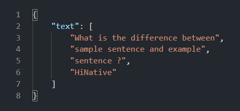

# Assignment 04
## Todo App
Simple Todo API Application Based on FastAPI & Sqlite
| ENDPOINTS               | HTTP METHOD | PARAMETERS    | DESCERIPTION                  |
|-------------------------|-------------|---------------|-------------------------------|
| /todos                  | GET         |             - | Return All Todos              |
| /todos                  | POST        |title:str,description:str               | Create New Todo        |
| /todos/{id}             | GET         | id:int | Get Specific Todo |
| /todos/{id}             | PUT         | id:int, title:str, description:str, status:int  | Update Specific Todo       |
| /todos/{id}             | DELETE         | id:int | Delete Specific  Todo       |

## Image Based API

Get Image As Parameter Then Return Words And Sentence In Iamge

Input:
Output: 